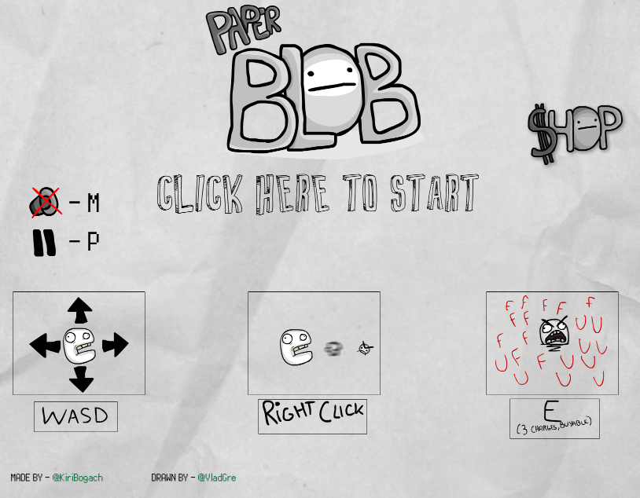
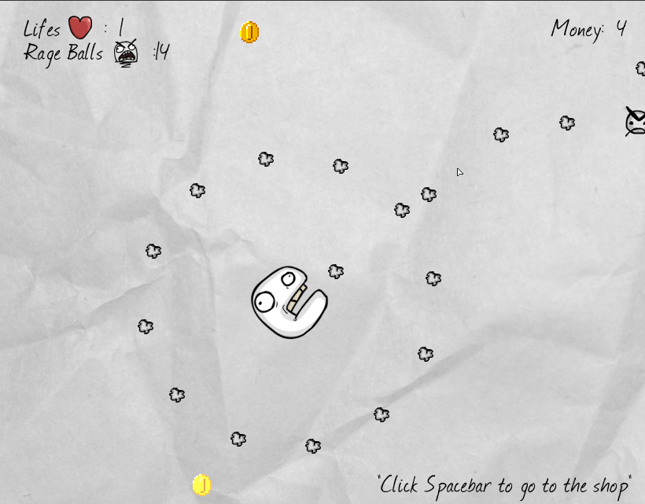
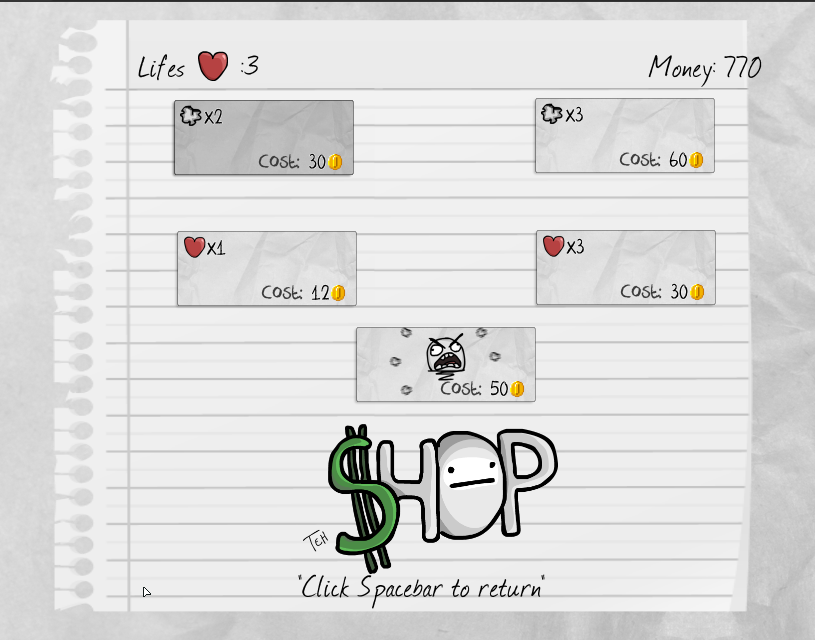

# Paper Blob - Stencyl

[Stencyl](https://github.com/Stencyl/stencyl-engine) is a video game development tool that allows users to create 2D video games for computers, mobile devices, and the web.

This was my first flash game/project developed in high school. I believe this was the *click* to start coding and start my software journey.

When I was in my first yearn in the `Software Engineer` degree I developed a C version from Scratch: [Paper Blob - SDL](https://github.com/kyryl-bogach/paper-blob-sdl)

## Files
* `paper_blob.swf` is the flash game itself that must be loaded
* `paper_blob_project.stencyl` is the original Stencyl project.
* `src` is the decompressed version of `paper_blob_project.stencyl`

## Play
It is uploaded in the `Stencyl Arcade App Store`: [Paper Blob](http://www.stencyl.com/game/play/24752)

Since web browers have deprecated the usage of flash, we need to download the `Adobe Flash Player`. 

1. [Download Adobe Flash Player Client](https://www.adobe.com/support/flashplayer/debug_downloads.html)
2. Use this [URL](http://kyryl.bogach.es/paper_blob.swf) or download [.swf](paper_blob.swf) file and import it in the client

## Screenshots
### Main menu with tutorial:

### Gameplay:

### Shop:

_**Secret**: If you are in the shop and you click in the same position as in the shop screenshot, you will earn 100 coins 😁_

_**Fun fact**: As you can see, the `money` counter were not supported for +99 coins because I never thought anyone would gather that many coins_ 
